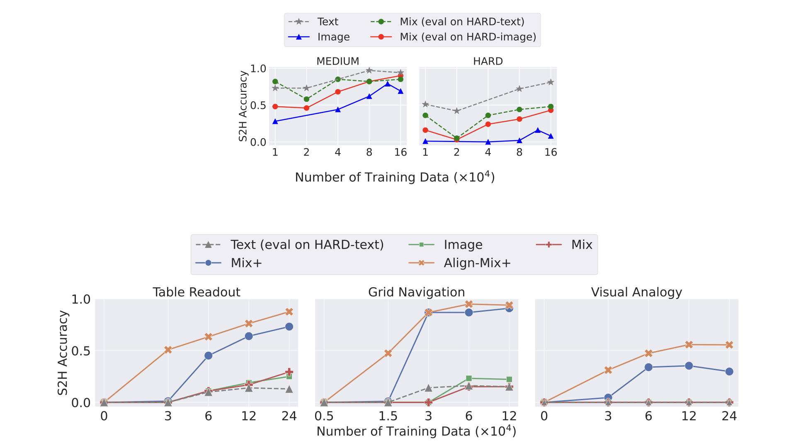

## Generalizing from SIMPLE to HARD Visual Reasoning: Can We Mitigate Modality Imbalance in VLMs?

This repository contains the code for our paper [Generalizing from SIMPLE to HARD Visual Reasoning: Can We Mitigate Modality Imbalance in VLMs?](https://arxiv.org/abs/2501.02669)

**************************** **Updates** ****************************
* 01/06/2025: We released [our paper](https://arxiv.org/abs/2501.02669). Check it out!

## Quick Links

- [Generalizing from SIMPLE to HARD Visual Reasoning: Can We Mitigate Modality Imbalance in VLMs?](#generalizing-from-simple-to-hard-visual-reasoning-can-we-mitigate-modality-imbalance-in-vlms)
- [Quick Links](#quick-links)
- [Overview](#overview)
- [Main Results](#main-results)
- [Experiments](#experiments)
  - [Prepare Conda Environment](#prepare-conda-environment)
  - [Prepare EAGLE Data (Requires 2.5M Data Files + 1TB Storage)](#prepare-eagle-data-requires-25m-data-files--1tb-storage)
  - [Prepare EAGLE-X2-Llama3-8B](#prepare-eagle-x2-llama3-8b)
  - [Prepare Synthetic Data (Highly Recommend Multi-thread Processing)](#prepare-synthetic-data-highly-recommend-multi-thread-processing)
  - [Prepare Evaluation Data](#prepare-evaluation-data)
  - [Train / Evaluate on Synthetic Data](#train--evaluate-on-synthetic-data)
- [Model links](#model-links)
- [Evaluation dataset links](#evaluation-dataset-links)
- [Bugs or Questions?](#bugs-or-questions)
- [Citation](#citation)

## Overview

We introduce a synthetic framework to evaluate the ability of VLMs to perform algorithmic visual reasoning (AVR) that consists of three tasks: *Table Readout*, *Grid Navigation*, *Visual Analogy*. Each task has two levels of difficulty, SIMPLE and HARD, and even the SIMPLE versions are difficult for frontier VLMs. We identify strategies that training on the SIMPLE version of tasks is sufficient to improve performance on the corresponding HARD version, i.e., simple-to-hard (S2H) generalization. Meanwhile, the inputs of each task can be presented in both an image or a text format, which allows a quantification of the modality imbalance and how it is impacted by different training strategies. Our key insights include:
1. Mixing various types of text-based and image-based supervision results in improved S2H generalization on images, given the model achieves good S2H generalization on text inputs;
2. When the model fails at both S2H generalization on image and text inputs, injected reasoning capability in the text modality brings improvement in S2H generalization on images; 
3. Our mechanistic study of this phenomenon using a measure of gradient alignment inspired a more effective two-phase training that further promote better S2H generalization on images.


## Main Results

We create two sets of tasks: first set contains those tasks where the model trains only on SIMPLE examples and learns to generalize on HARD examples better on text modality. The second set contains tasks where the model fails to generalize to HARD examples by simply training on SIMPLE examples. In such task, we inject HARD text examples in training and measure how much the model can generalize on HARD images. We primarily compare the following 5 supervision techniques.
1. **Text** supervision: Train only on SIMPLE text examples
2. **Image** supervision: Train only on SIMPLE image examples
3. **Image-via-text** supervision: Trains on SIMPLE image examples that teaches to convert to text before generating solution.
4. **Mix** supervision: mixture of Image, Text and Image-via-text supervision.
5. **Mix+** supervision: HARD text examples added to Mix supervision to inject HARD text reasoning.
6. **Align-Mix+** supervision: Two stage strategy that first trains on Image-via-text supervision on SIMPLE examples and then trains with Mix+.

We show the main results of our proposed training strategies. Please see more detailed results and ablation findings in our paper. 



## Experiments

In the following section, we provide instructions on reproducing the experiments in our paper.

### Prepare Conda Environment

First, set the following bash variable based on your machine and update one of the files.
```Shell
PROJECT_DIR="/absolute path to the project folder/VLM_S2H"
sed -i "s#CHECKPOINTS_ROOT = None#CHECKPOINTS_ROOT = '${PROJECT_DIR}/checkpoints'#" $PROJECT_DIR/VLMEvalKit/vlmeval/config.py
```

Then prepare a conda environment using the following commands
```Shell
cd $PROJECT_DIR
conda create -n VLM_S2H python=3.10 -y
conda activate VLM_S2H
pip install pip==24.3.1  # enable PEP 660 support 
pip install torch==2.1.2 torchvision==0.16.2 torchaudio==2.1.2 --index-url https://download.pytorch.org/whl/cu118
pip install -r requirements.txt
pip install -e VLMEvalKit # requirement: pip < 25.0
```

### Prepare EAGLE Data (Requires 2.5M Data Files + 1TB Storage)

First, prepare the pretraining data from LLaVA using the following commands
```Shell
cd $PROJECT_DIR/pretraining_data
git lfs install
git clone https://huggingface.co/datasets/liuhaotian/LLaVA-CC3M-Pretrain-595K
cd LLaVA-CC3M-Pretrain-595K
unzip images.zip
```
Note: some of the images in the chat.json file may no longer be available in the images.zip due to copyright. You may have to delete some of the entries in the json file if the images are not available.

Next, prepare the visual instruction tuning data from EAGLE using the following commands

```Shell
cd $PROJECT_DIR/pretraining_data
git lfs install
git clone https://huggingface.co/datasets/shi-labs/Eagle-1.8M
cd Eagle-1.8M
cat images.tar.part_* > images.tar.gz
tar -xvzf images.tar.gz
```

### Prepare EAGLE-X2-Llama3-8B

To obtain the base VLM model used in our experiments, fill out cluster-specific details in both bash scripts `pretrain-eagle-x2-llama3-8b.sh` and `finetune-eagle-x2-llama3-8b-1.8m.sh` under `scripts/prepare_eagle/`, then run

```Shell
cd $PROJECT_DIR
sbatch scripts/prepare_eagle/pretrain-eagle-x2-llama3-8b.sh
sbatch scripts/prepare_eagle/finetune-eagle-x2-llama3-8b-1.8m.sh
```

### Prepare Synthetic Data (Highly Recommend Multi-thread Processing)

Each setting may take up to 24 hours without multi-thread processing. It is highly recommended to create a custom bash script and split the load.

To create Consecutive Table Readout data,
```Shell
cd $PROJECT_DIR/data_generation/consecutive_table_readout
source generate_data.sh
source generate_eval_data.sh
```

To create Table Readout data,
```Shell
cd $PROJECT_DIR/data_generation/table_readout
source generate_data.sh
source generate_eval_data.sh
```

To create Grid Navigation data,
```Shell
cd $PROJECT_DIR/data_generation/grid_navigation
source generate_data.sh
source generate_eval_data.sh
```

To create Visual Analogy data,
```Shell
cd $PROJECT_DIR/data_generation/visual_analogy
source generate_data.sh
```

### Prepare Evaluation Data

The following command converts the `.json` file in the visual instruction tuning data format to .tsv file that [VLMEvalKit](https://github.com/open-compass/VLMEvalKit/tree/8106439c2d3b07353c84374bebdd947d4ec16a8f) accepts.

```Shell
cd $PROJECT_DIR/VLMEvalKit
python -m vlmeval.build_our_data
```

### Train / Evaluate on Synthetic Data

To train and evaluate on the synthetic tasks, fill out cluster-specific details in the bash script `scripts/launcher.sh`, then run
```Shell
cd $PROJECT_DIR
source scripts/launcher.sh # see the script for example usage
```

We explain the arguments used in `launcher.sh` as follows:
- the first argument specifies the setting index (0 for Consecutive Table Readout, 1 for Table Readout, 2 for Grid Navigation, 3 for Visual Analogy)
- the second argument specifies the option index/indices (explained in `scripts/combine_data.py` and the following)
  - `1`: Image-via-text supervision with 3 epochs
  - `2`: Text supervision with 2 epochs
  - `3`: Image supervision with 2 epochs
  - `4`: Image supervision with 3 epochs
  - `5`: Image+Text supervision with 1.5 epochs
  - `6`: Mix supervision with 1 epoch
  - `7`: Mix+ supervision with 1 epoch
  - `8`: Align-Mix+ supervision first phase
  - `9`: Image-via-Text+ supervision with 3-epoch training on SIMPLE image
- the third argument specifies the number of training data in thousands (e.g. `30` means 30k training data)
- the optional fourth argument allows you to customize tags to differentiate runs of the same setup (e.g. `-noCoT`)
- optionally, you may also run `export no_cot=_noCoT` to enable training and evaluation without the use of CoT 

Following the above specifications, an example usage is
```Shell
source scripts/launcher.sh 0 1,2 60
```
This will train and evaluate two models for the Consecutive Table Readout task: one with Image-via-text supervision 60k data, and the other with Text supervision 60k data.

## Model links

We release links to our different trained models for easier experimentations in the future.

| Model Name | Model Link |
|------------|------------|
|    Eagle-X2-Llama3-8B        |      [Link](https://huggingface.co/PrincetonPLI/Eagle-X2-Llama3-8B)      |
|    Mix supervision on Consecutive Table Readout        |      [Link](https://huggingface.co/PrincetonPLI/Eagle-X2-Llama3-8B-ConsecutiveTableReadout-Mix-160k)      |
|    Mix+ supervision on Table Readout   |     [Link](https://huggingface.co/PrincetonPLI/Eagle-X2-Llama3-8B-TableReadout-MixPlus-240k)       |
|    Mix+ supervision on Grid Navigation |     [Link](https://huggingface.co/PrincetonPLI/Eagle-X2-Llama3-8B-GridNavigation-MixPlus-120k)       |
|    Mix+ supervision on Visual Analogy  |     [Link](https://huggingface.co/PrincetonPLI/Eagle-X2-Llama3-8B-VisualAnalogy-MixPlus-120k)       |
|    Align-Mix+ supervision on Table Readout   |    [Link](https://huggingface.co/PrincetonPLI/Eagle-X2-Llama3-8B-TableReadout-AlignMixPlus-240k)        |
|    Align-Mix+ supervision on Grid Navigation |    [Link](https://huggingface.co/PrincetonPLI/Eagle-X2-Llama3-8B-GridNavigation-AlignMixPlus-120k)        |
|    Align-Mix+ supervision on Visual Analogy  |    [Link](https://huggingface.co/PrincetonPLI/Eagle-X2-Llama3-8B-VisualAnalogy-AlignMixPlus-120k)        |

## Evaluation dataset links

We release the evaluation datasets that we used for reproducibility. [Link](https://github.com/princeton-pli/VLM_S2H/tree/main/VLMEvalKit/dataset)


## Bugs or Questions?

If you have any questions related to the code or the paper, feel free to email Simon (juhyunp 'at' princeton 'dot' edu), Abhishek (ap34 'at' princeton 'dot' edu), and Yun (yc6206 'at' princeton 'dot' edu). If you encounter any problems when using the code, or want to report a bug, you can open an issue. Please try to specify the problem with details so we can give more effective help!

## Citation

Please cite our paper if you find our paper or this repo helpful:
```bibtex
@misc{park2025generalizingsimplehardvisual,
      title={Generalizing from SIMPLE to HARD Visual Reasoning: Can We Mitigate Modality Imbalance in VLMs?}, 
      author={Simon Park and Abhishek Panigrahi and Yun Cheng and Dingli Yu and Anirudh Goyal and Sanjeev Arora},
      year={2025},
      eprint={2501.02669},
      archivePrefix={arXiv},
      primaryClass={cs.CV},
      url={https://arxiv.org/abs/2501.02669}, 
}
```
